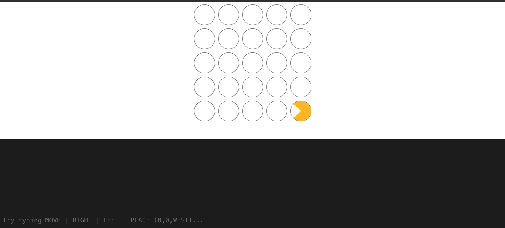
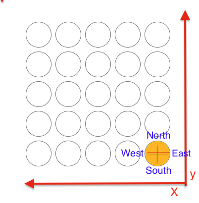

# Pacman Simulator

This project was bootstrapped with [Create React App](https://github.com/facebook/create-react-app).

## Available Scripts

In the project directory, you can run:

### `yarn start`

Runs the app in the development mode.\
Open [http://localhost:3000](http://localhost:3000) to view it in the browser.

The page will reload if you make edits.\
You will also see any lint errors in the console.

### `yarn test`
** Test is written with Jest and Enzyme**
Launches the test runner

### `yarn build`

Builds the app for production to the `build` folder.\

### `yarn lint`
Script for fixing where possible & printing all linting errors

## Technical Decision:
- Project is developed with [React App](https://github.com/facebook/create-react-app) & TypeScript based on the timeframe & complexity of the requirements
- Project is using prettier-eslint for linting & code formatting to maintain code standards
- Project came with customised vscode config for easier local set up
- CSS standards are reinfoced using stylint
- Assumtion from the exercise info: 

